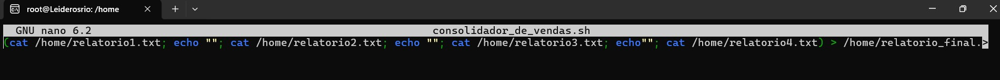

# SPRINT 1

Nesta primeira Sprint automatizamos uo processamento de dados de vendas, garantindo que o arquivo fosse copiado para um diretório específico e armazenado em beckupsb diários e com data de execução no nome do arquivo, gerando relatórios com dados importantes com a data do sistema, informações dos registros e mais.

# Evidências

## Etapa 1: 

### Etapa 1.1 

