# SPRINT 2 

# Evidencias:
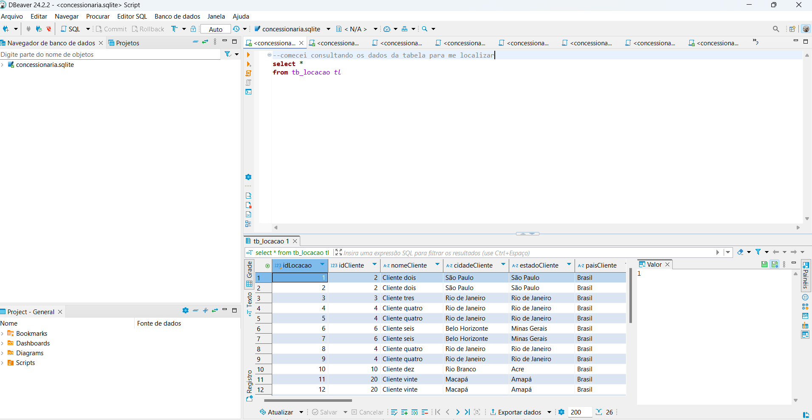
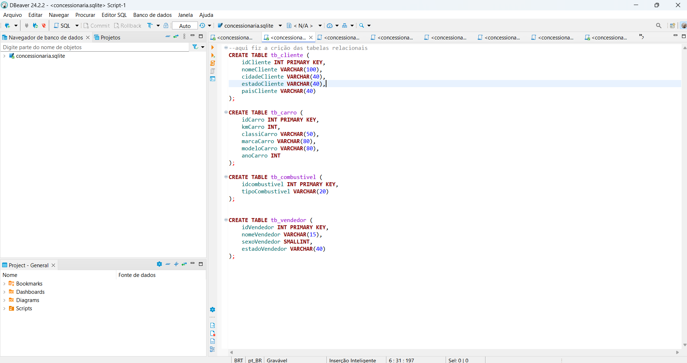
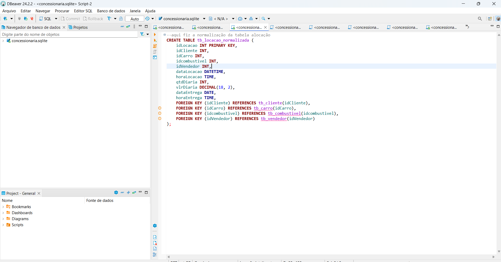
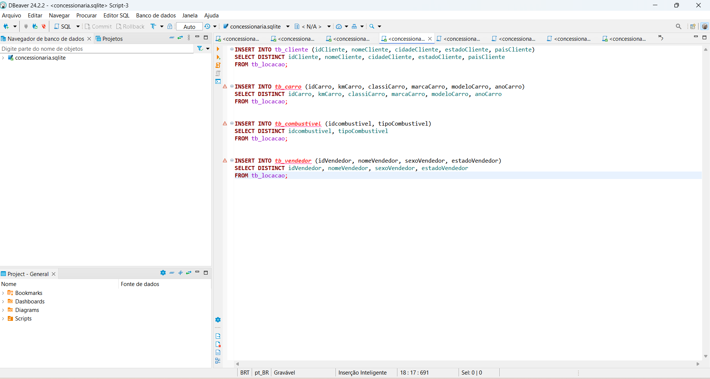
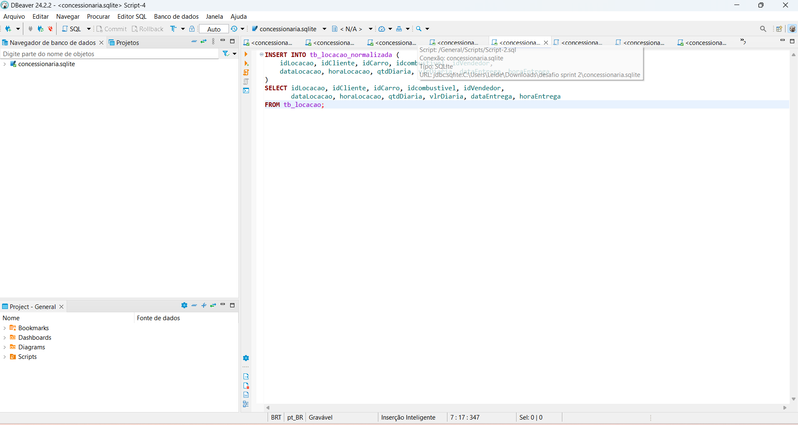
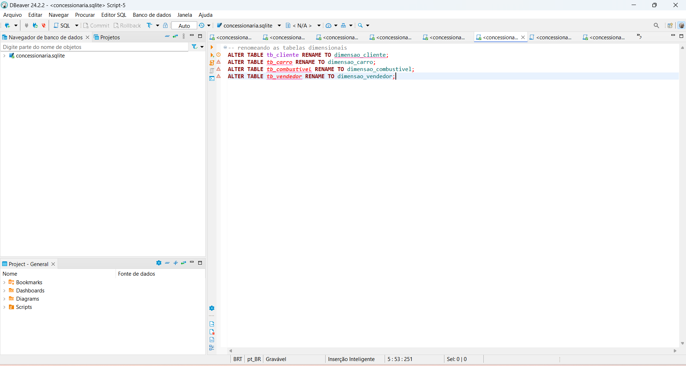
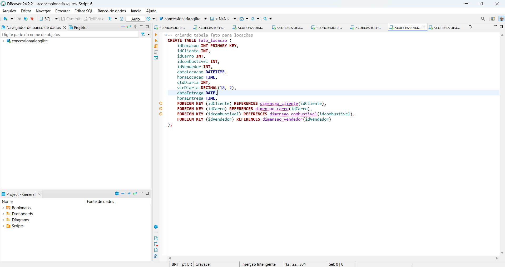
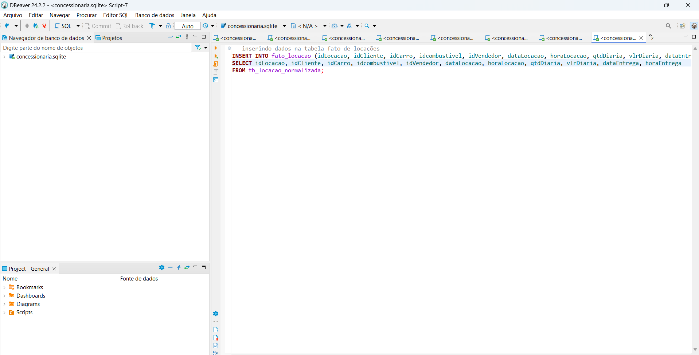
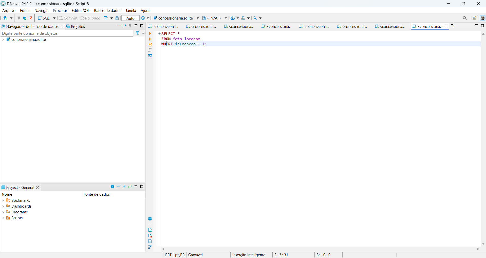
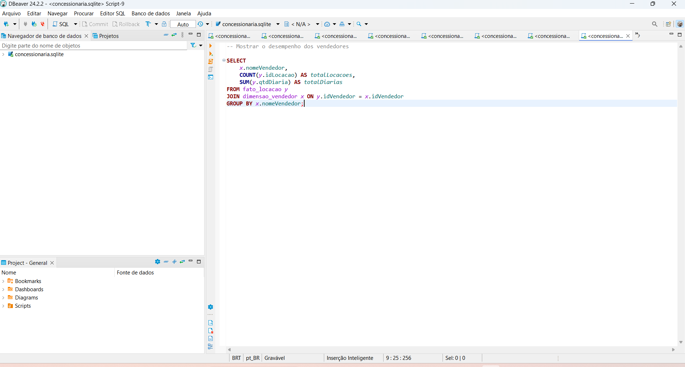
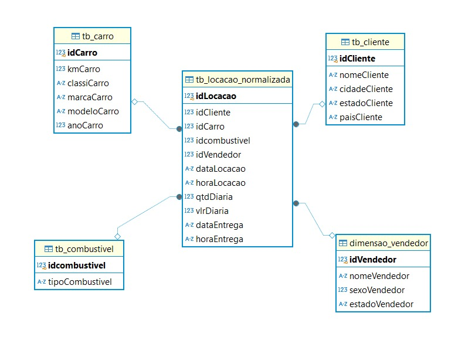

 
# Exercícios

## Exercícios seção 3

[E01.sql](/EXERCÍCIOS/Seção%203/E01.sql)
[E02.sql](/EXERCÍCIOS/Seção%203/E02.sql)
[E03.sql](/EXERCÍCIOS/Seção%203/E03.sql)
[E04.sql](/EXERCÍCIOS/Seção%203/E04.sql)
[E05.sql](/EXERCÍCIOS/Seção%203/E05.sql)
[E06.sql](/EXERCÍCIOS/Seção%203/E06.sql)
[E07.sql](/EXERCÍCIOS/Seção%203/E07.sql)

## Exercícios seção 4
[E08.sql](/EXERCÍCIOS/Seção%204/E08.sql)
[E09.sql](/EXERCÍCIOS/Seção%204/E09.sql)
[E10.sql](/EXERCÍCIOS/Seção%204/E10.sql)
[E11.sql](/EXERCÍCIOS/Seção%204/E11.sql)
[E12.sql](/EXERCÍCIOS/Seção%204/E12.sql)
[E13.sql](/EXERCÍCIOS/Seção%204/E13.sql)
[E14.sql](/EXERCÍCIOS/Seção%204/E14.sql)
[E15.sql](/EXERCÍCIOS/Seção%204/E15.sql)

# Certificados
Meu certificado da AWS
[Certificado AWS](/CERTIFICADOS/AWS%20Partner%20Sales%20Accreditation%20Business%20Leide%20Luciana%20pinto%20do%20Rosário.pdf)
