# SPRINT 4 
[Sprint 4](Sprint4) Nesta sprint trabalhamos o docker:

Fizemos a criação de uma imagem  partir de uma imagem base do Python, construímos uma nova imagem personalizada chamada "mascarar-dados". Onde essa imagem continha o script Python criado anteriormente e todas as dependências necessárias para sua execução.
Em seguida iniciamos uo container a partir da imagem recém-criada. Ao iniciar o container, fornecemos ao script Python as palavras que devem ser mascaradas.
Em seguida egistramos o código do script Python, o conteúdo do Dockerfile e o comando utilizado para iniciar o container.

# Evidencias:
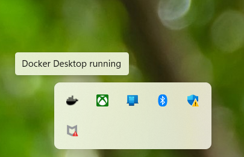
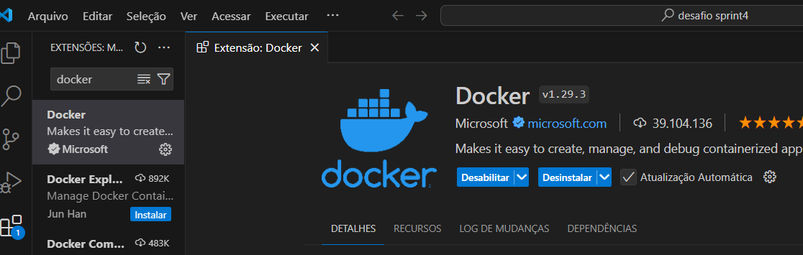
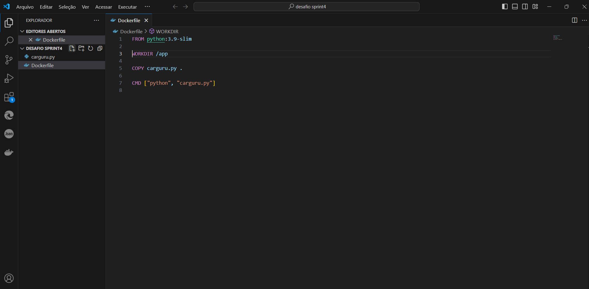
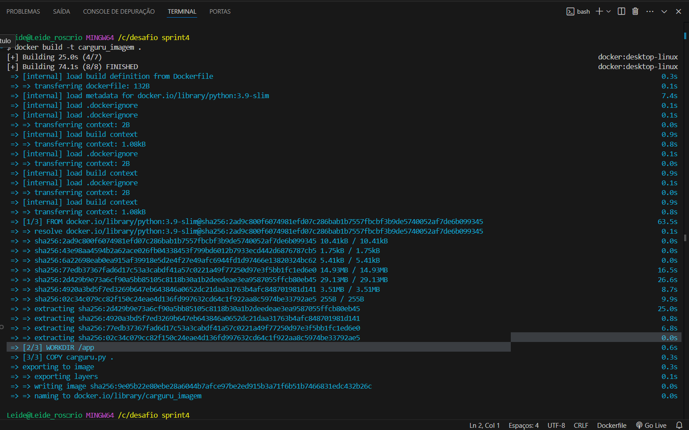
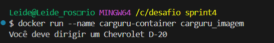

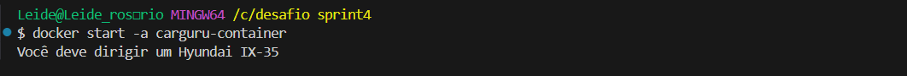
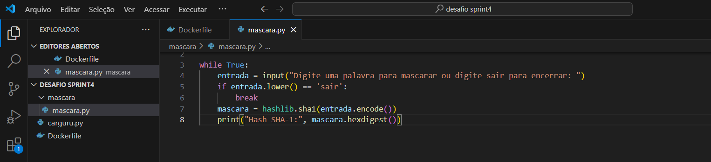
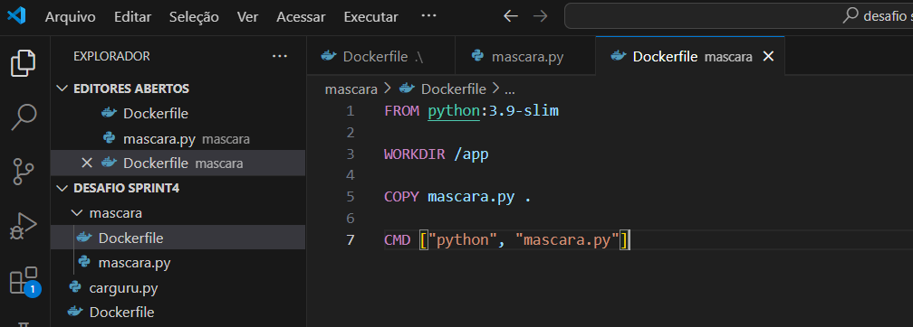
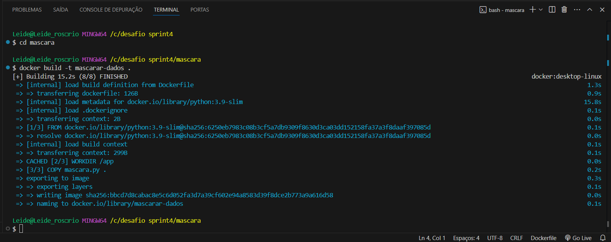
![Img11.jpg]Evidências/img11.jpg.png)
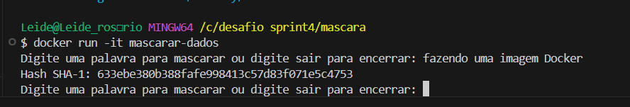
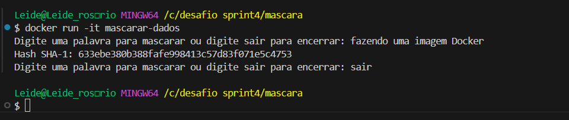
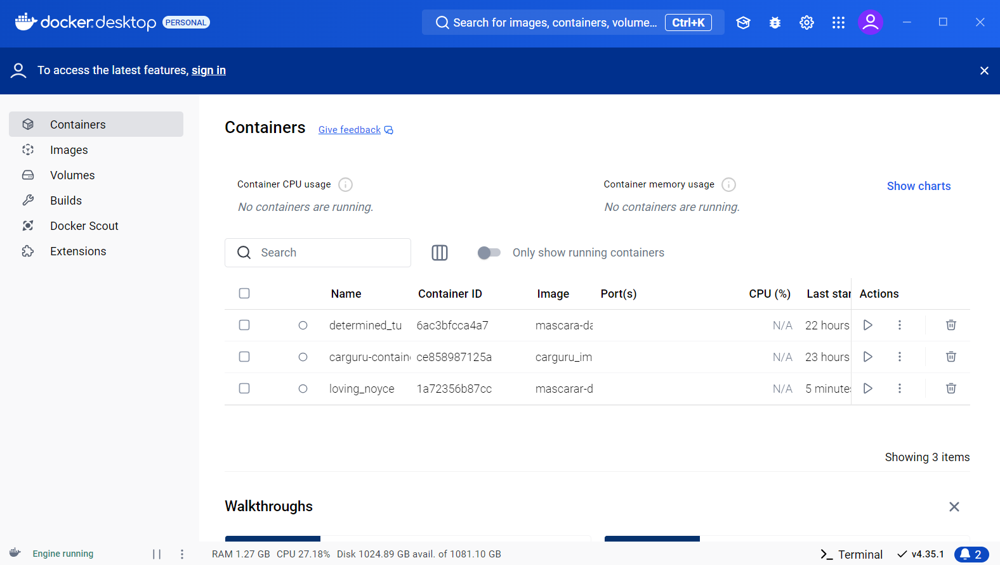

 
# Exercícios

[E01.py](/EXERCÍCIOS/E01.py)
[E02.py](/EXERCÍCIOS/E02.py)
[E03.py](/EXERCÍCIOS/E03.py)
[E04.py](/EXERCÍCIOS/E04.py)
[E05.py](/EXERCÍCIOS/E05.py)
[E06.py](/EXERCÍCIOS/E06.py)
[E07.py](/EXERCÍCIOS/E07.py)

# Certificados
Meu certificado da AWS
[Certificado AWS](/Certificados/AWS-4.png)
