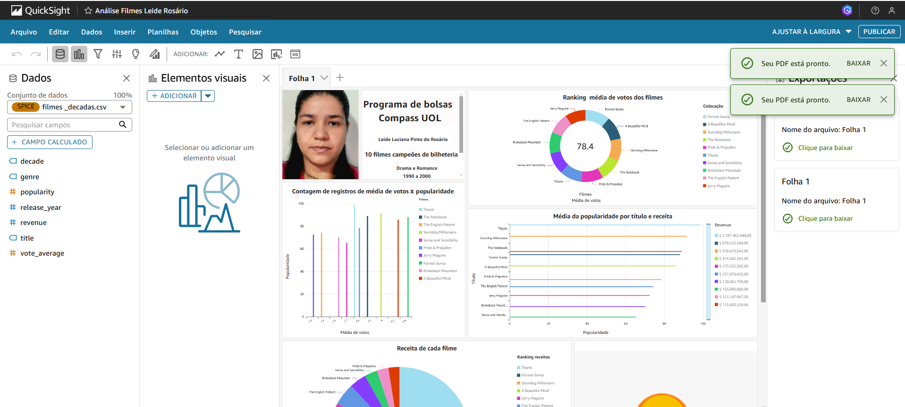
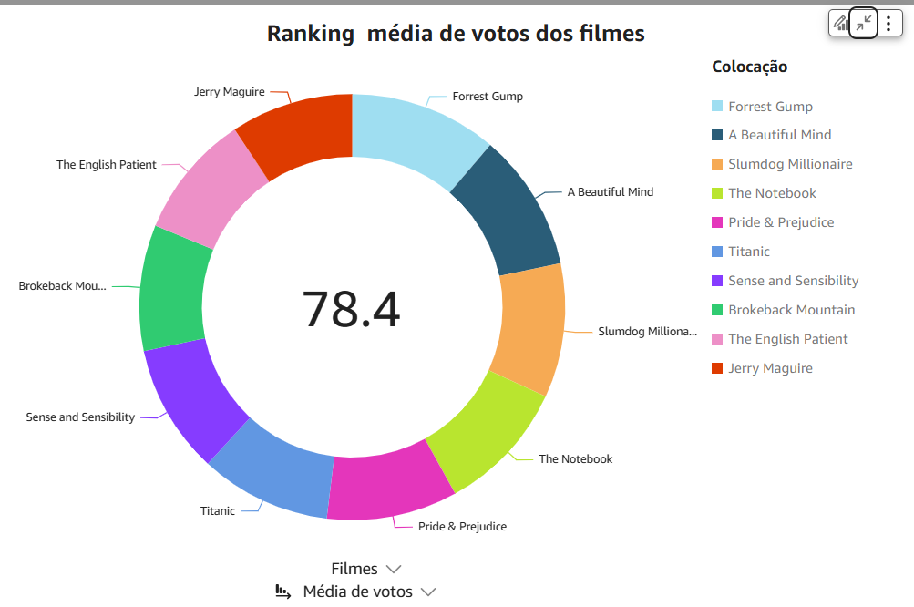
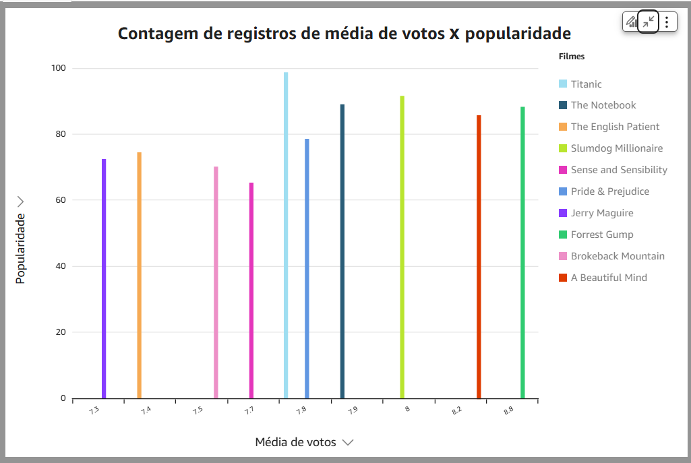
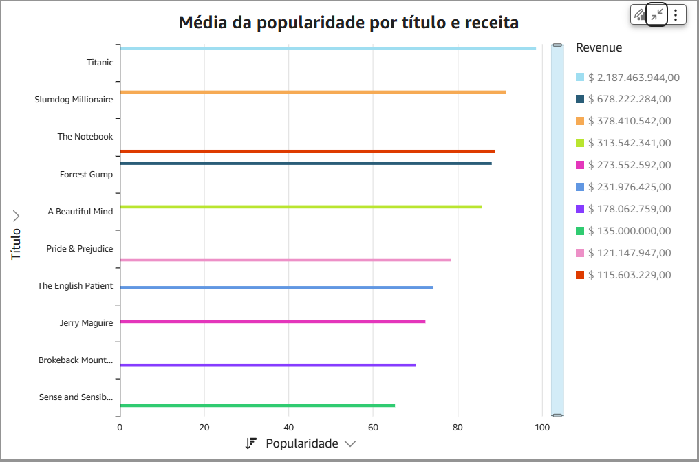
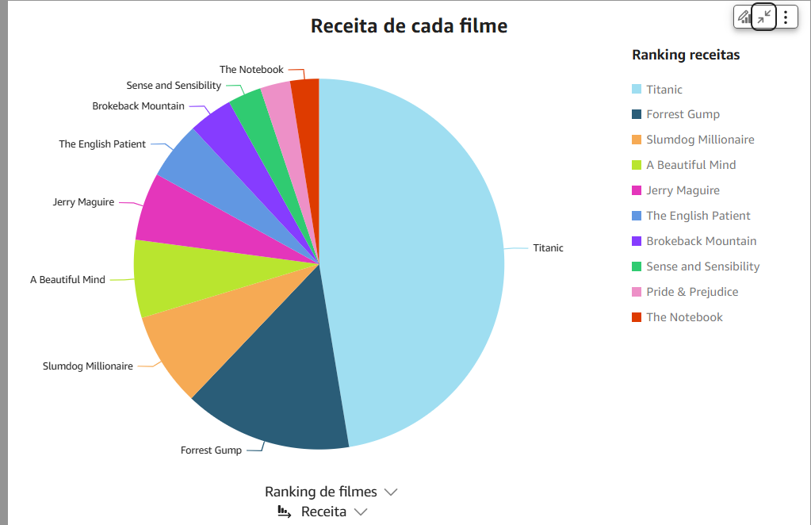
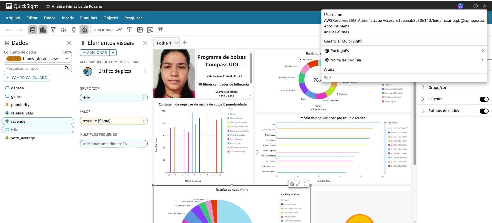

io# SPRINT 10
Nesta sprint trabalhei a finalização do desafio, onde fiz a análise de Dados dos 10(dez) Filmes de drama e romance campeões de bilheteriano período de 1990 a 2000, onde analisei a popularidade, ano lançamento, receita, título, média de votos e gênero.
Criei através do Quicksight o dashboard para a visualização mais clara dos mesmos, e fiz relações entre eles para demonstrar insights sobre os tema. 

# Desafio
A seguir podemos ver o painel de dashboard que foi feito no Quicksight no formato em PDF e o link para ser acessado de forma responsiva.

[Clique no link para ver minha página do Quicksight](https://us-east-1.quicksight.aws.amazon.com/sn/accounts/971422675828/dashboards/37fa0784-4562-4a40-91fe-25bf24d1b3c0?directory_alias=analise-filmes)

[Abrir PDF](/painel_quicksight.pdf)

# Evidências

# Certificado

Certificado AWS Quicksight

[certificado AWS](certificado/certificado.png)
