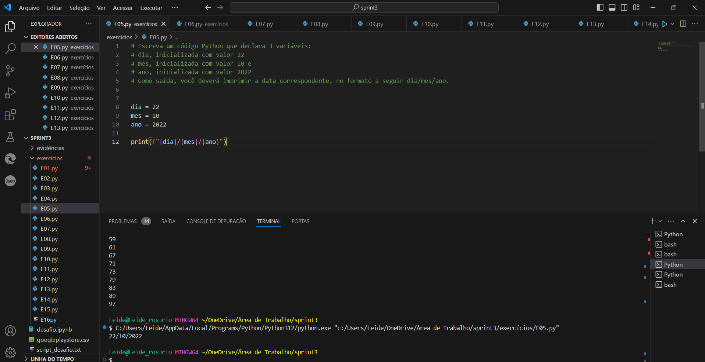

# SPRINT 3 
Nesta sprint  foi feito a análise exploratória de um conjunto de dados sobre aplicativos da Google Play Store, armazenado em um arquivo CSV. Utilizando as bibliotecas Python Pandas e Matplotlib. Ao analisar esse conjunto de dados, podemos extrair insights valiosos sobre diversos aspectos, como:

Popularidade de aplicativos: Identificar os aplicativos mais populares, com base no número de instalações, avaliações e classificações.
Categorias de aplicativos: Analisar a distribuição de aplicativos por categorias para entender quais segmentos são mais populares.
Qualidade dos aplicativos: Avaliar a qualidade dos aplicativos com base em suas avaliações e classificações.
Relação entre preço e popularidade: Investigar se existe uma correlação entre o preço de um aplicativo e sua popularidade.
Tamanho dos aplicativos: Analisar a distribuição dos tamanhos dos aplicativos e sua relação com outras características.
Tendências do mercado: Identificar tendências emergentes no mercado de aplicativos, como o crescimento de determinadas categorias ou o aumento da importância de recursos específicos. Em resumo, a análise do conjunto de dados googleplaystore.csv permite obter insights valiosos sobre o mercado de aplicativos, auxiliar na tomada de decisões de desenvolvimento e marketing de aplicativos, e identificar oportunidades de negócio.

# Evidencias:

# Certificados
Meu certificado da AWS
[Certificado AWS](/CERTIFICADOS/AWS%20Partner%20Sales%20Accreditation%20Business%20Leide%20Luciana%20pinto%20do%20Rosário.pdf)
