# SPRINT 6 
[Sprint 6](Sprint4) 
O objetivo principal nesta sprint foi mostrar um ambiente prático na aws s3, AWS Athena, AWS Lambda, e mostrar como se faz um limpeza de recursos para finalizar o ambiente, com o intuito de não gerar desperdícios.

# Evidencias:
##Desafio

.
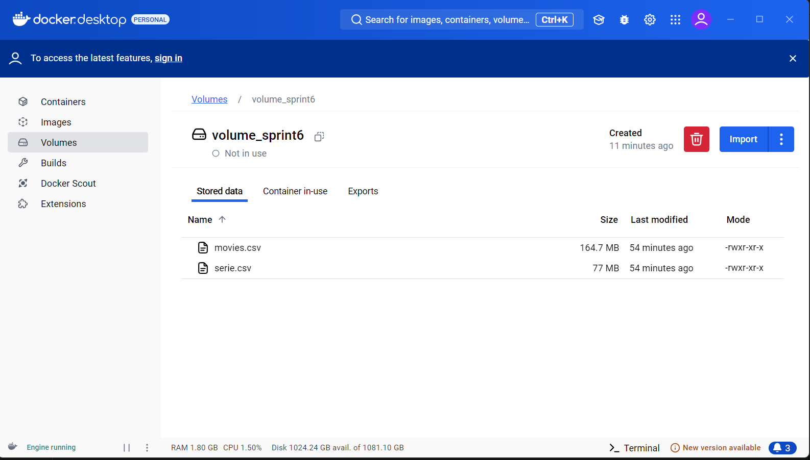.
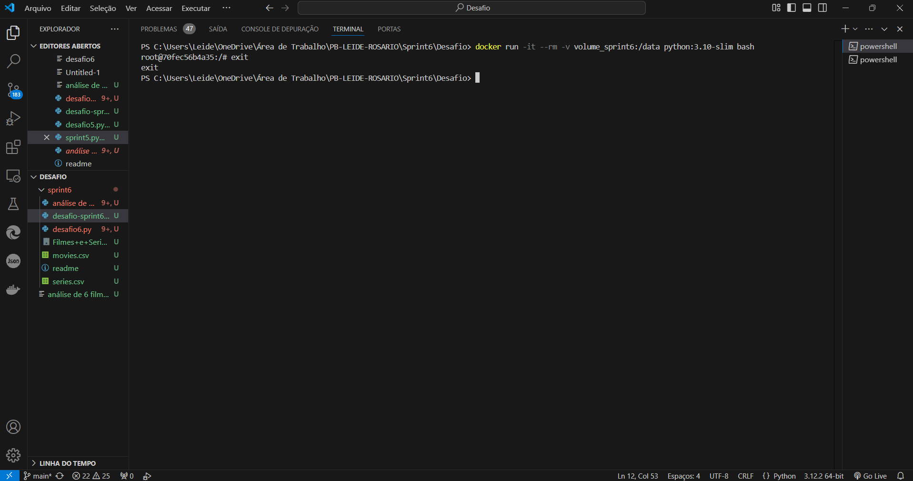.
.
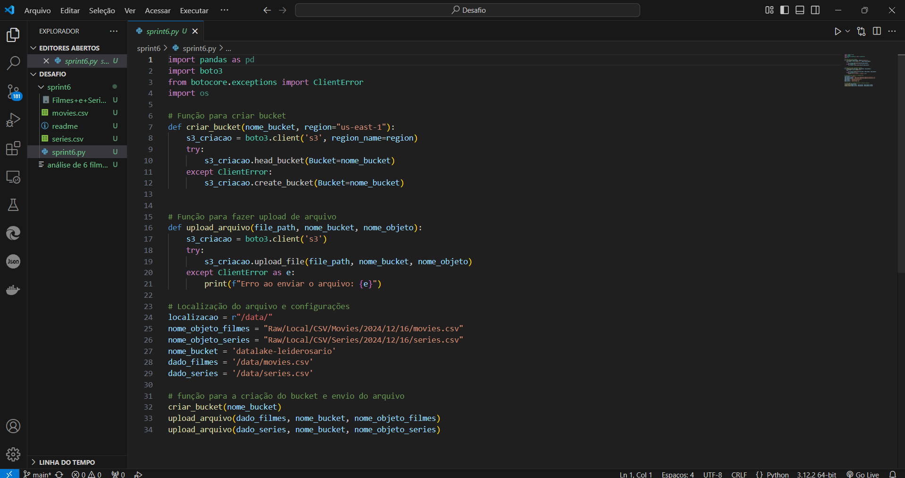.
.
.
.
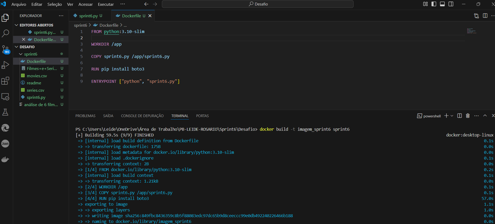.
.
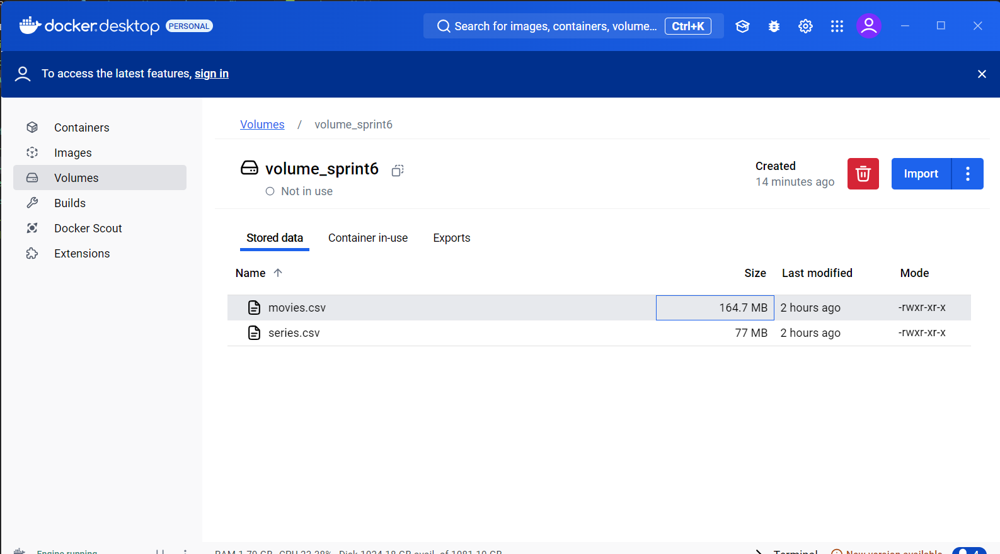.
.
.
.
.

 
## Exercício

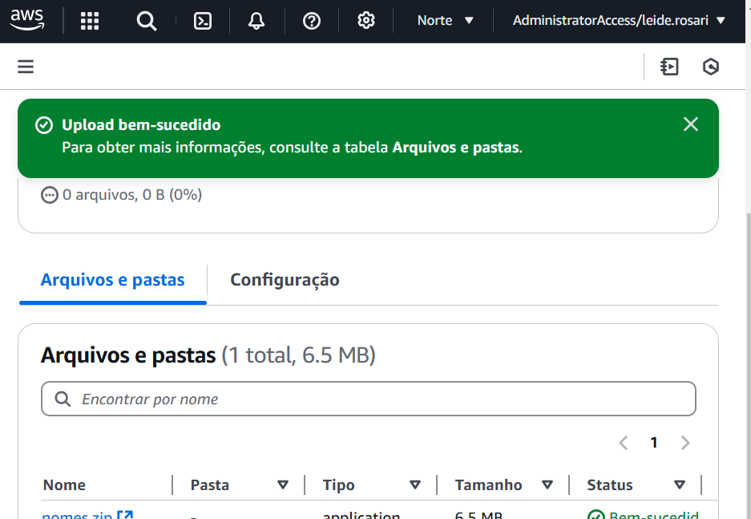
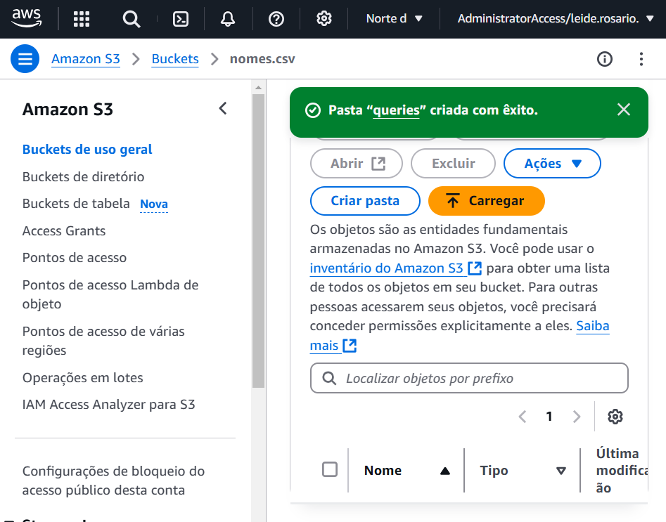
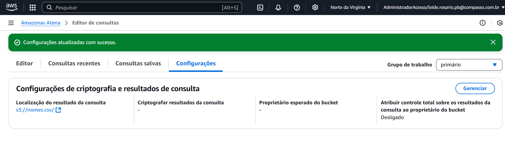

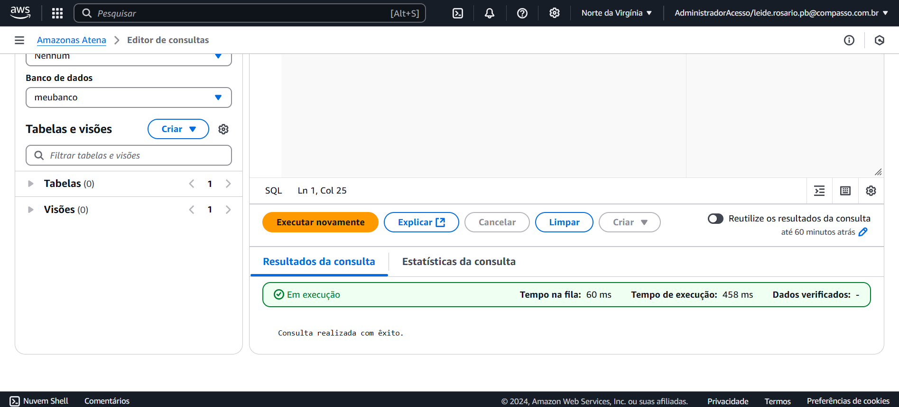
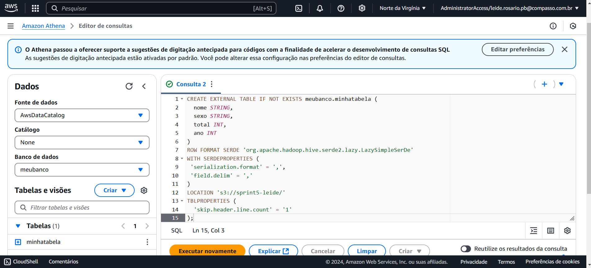
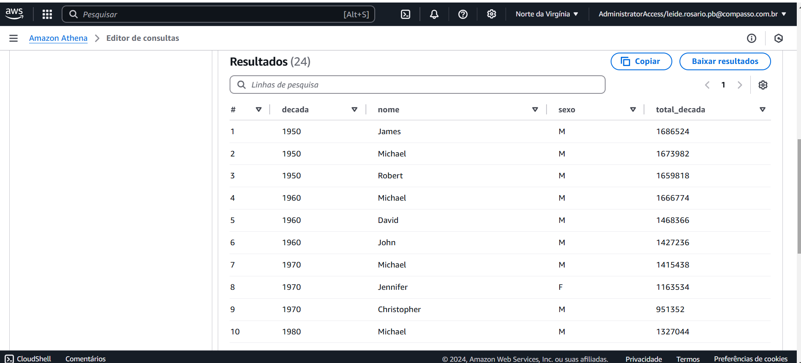

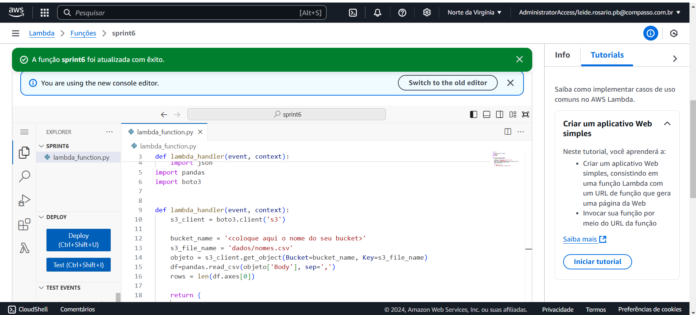

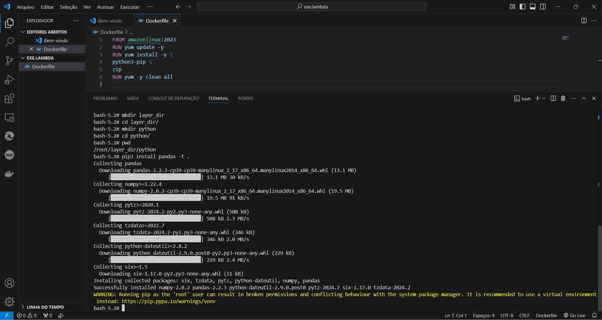

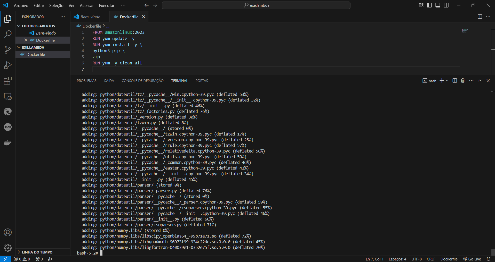
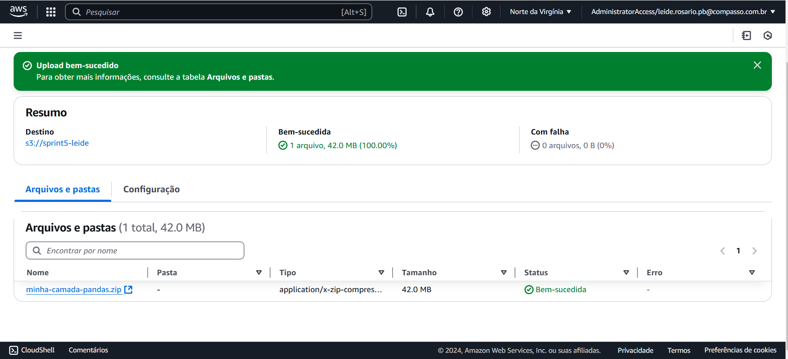
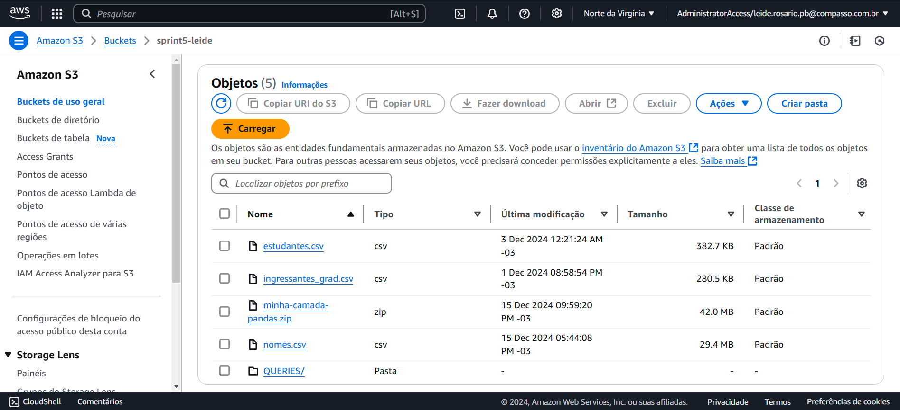
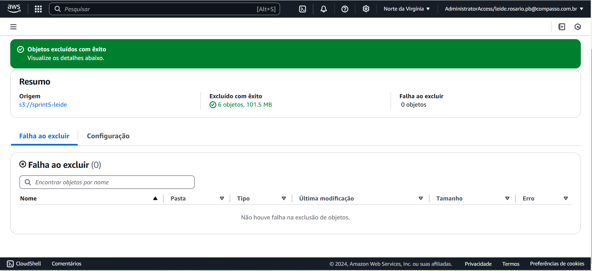

# Certificado
Meu certificado da AWS
[Certificados AWS](Certificado/AWS-4.png)
