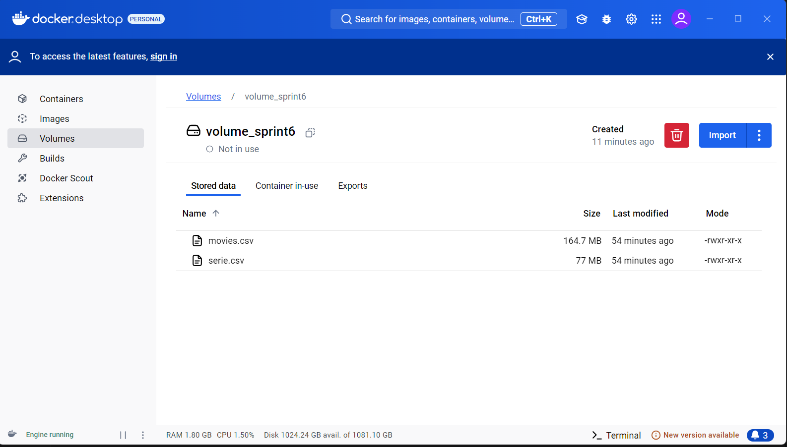
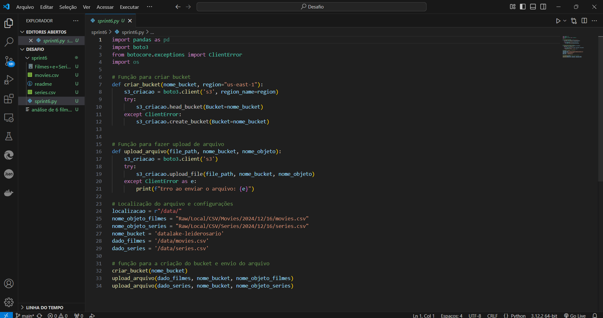
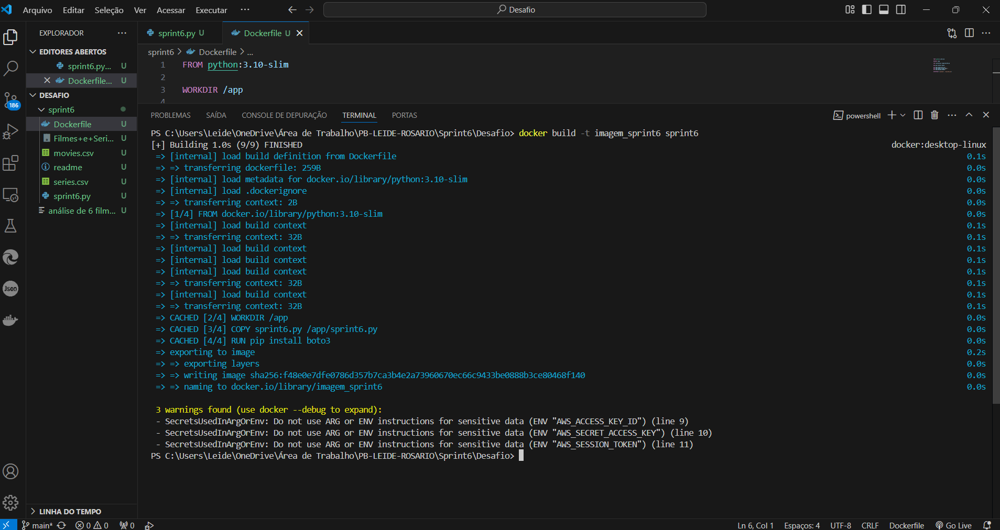
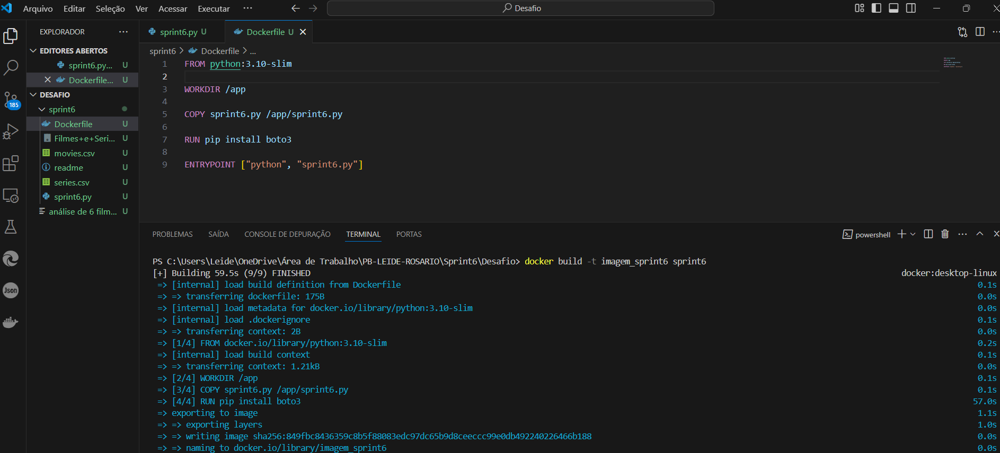
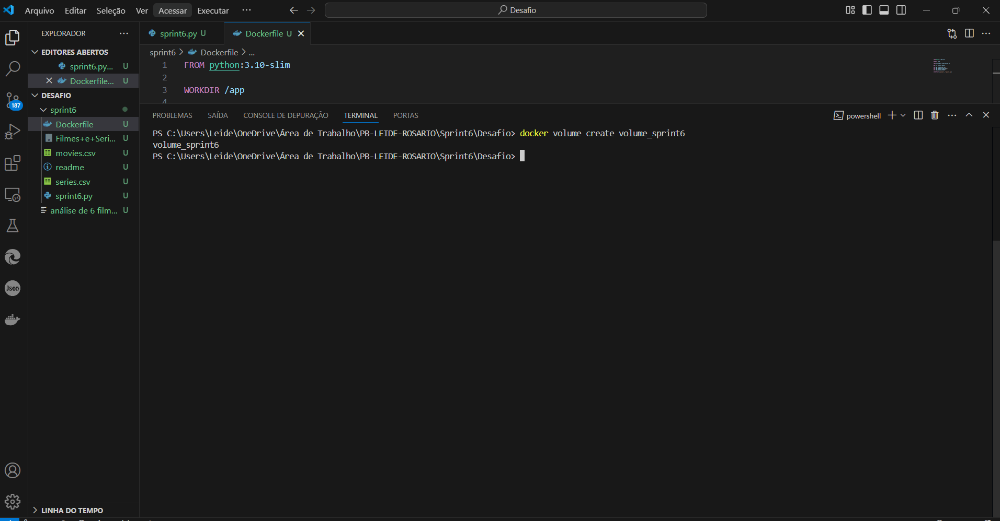

# SPRINT 6 
[Sprint 6](Sprint6) Neste desafio o objetivo principal é criar um Data Lake, um repositório centralizado para armazenar grandes volumes de dados estruturados e não estruturados. Nesse caso específico, os dados serão sobre filmes e séries.
Podemos observar todos os passos necessários através das evidências abaixo:

# Evidências:
## Desafio

