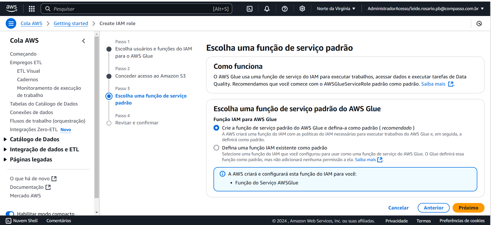

# SPRINT 7

Nesta sprint trabalhamos de forma prática nos laboratórios da AWS: s3, AWS Lambda, AWS Athena e glue, de forma que iniciamos a primeira parte do desafio final, onde fizemos a primeira análise do arquivo csv, que nos foi fornecido,com o intuito de fazer o levantamento de dados para a sprint de filmes e séries de drama e romance.  

# Evidências:

Abaixo podemos ver as principais evidências, tanto do desafio como dos exercícios de glue, tmdb e spark

## Evidências do desafio

## Evidências do exercício

### glue

Neste exercício de glue veremos todos os passos que foram realizados para a entrega da tarefa, passando por todas as etapas no ambiente da aws.

### spark

Abaixo veremos as principais evidências dos passos realizados no exercício de spark:

### TMDB
Abaixo podemos observar os passos que foram seguidos para a realização de cadastro e retirada de chave de API.

# Exercícios

O exercício de glue foi realizado porém apenas nas evidências poderemos ver sua realização, diferente dos demais (tmdb e spark), onde acrescentei os arquivos necessários para comprovar sua realização.

# Certificados

Abaixo veremos o certificado referente ao curso de spark que foi realizado na plataforma da UDEMY:

.

