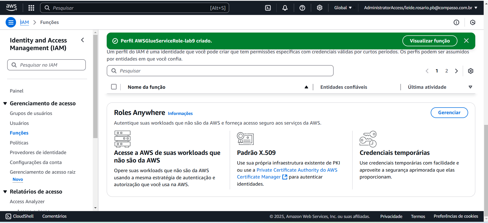

# SPRINT 9
Nesta sprint trabalhamos a continuação do processamento e Análise de Dados de Filmes de drama e romance, onde tem como objetivo consolidar os conhecimentos adquiridos no programa de bolsas, através da construção de um pipeline de processamento de dados para análise de filmes.

## Entregas
* **Entrega 1:** Coleta de dados de diversas fontes (IMDb, TMDB, etc.) e organização em um formato padrão.
* **Entrega 2:** Limpeza e transformação dos dados, incluindo tratamento de dados faltantes e inconsistentes.
* **Entrega 3:** Criação da camada Trusted, armazenando os dados limpos e padronizados no formato Parquet.
* **Entrega 4:** Criação da camada Refined, modelando os dados de forma multidimensional para facilitar a análise.
* **Entrega 5:** Desenvolvimento de dashboards interativos utilizando o QuickSight para explorar os dados e gerar insights.

# Desafio

# Evidências

# Certificado

Meu certificado da AWS

[Certificados AWS](certificados/cert.png)
